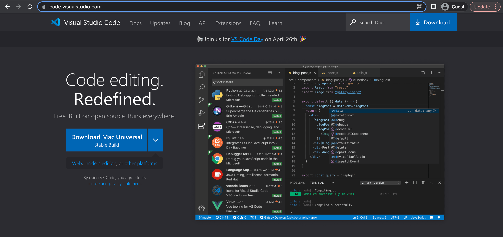
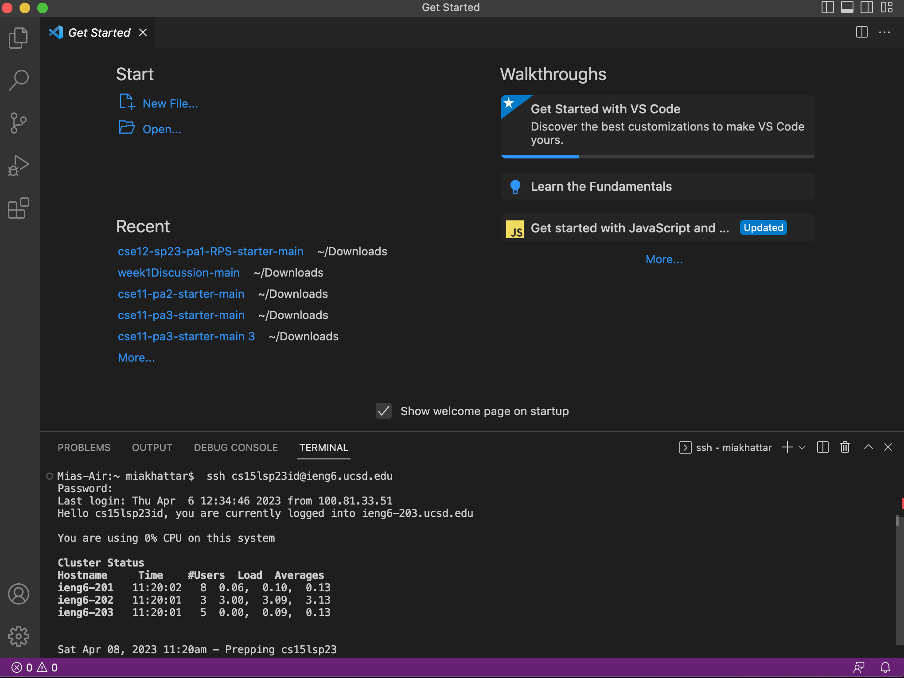
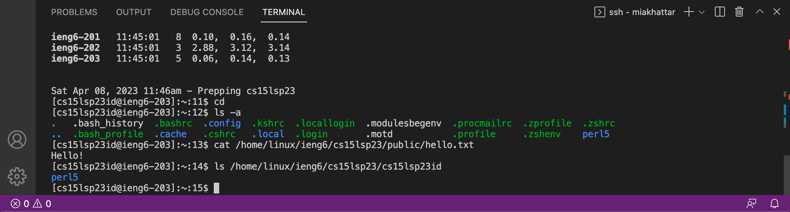

## Lab Report 1

This tutorial will be about how to install VSCode, remote connect, and typing in and testing out some useful commands in the terminal. 

## Installing VSCode

First, before you do anything else, you must install VSCode onto your computer. To install it please follow [this link](https://code.visualstudio.com/). Once you open the link you will see a website that looks like the following image.

Then, press download and follow the prompts it provides you until you have successfully installed it onto your computer.

## Installing Git (Windows Users Only)

If you are a Windows user, you must install git onto your computer in order to remote connect. To do this please follow [this link](https://gitforwindows.org/) and follow all of the procedures to download git onto your computer. After you complete the download, please follow the steps in [this post](https://stackoverflow.com/questions/42606837/how-do-i-use-bash-on-windows-from-the-visual-studio-code-integrated-terminal/50527994#50527994) to set your new terminal up to use git bash as its default.

## Remote Connecting

In order to remote connect, you must follow these three steps:

1. Log onto your account look up [here](https://sdacs.ucsd.edu/~icc/index.php) with your username and student PID. You will see a list of course specific accounts and you must change the password of your account for CSE 15L as you will be using this new password later.

2. Go to VSCode and open a new terminal and type in the command `ssh cs15lsp23zz@ieng6.ucsd.edu` but replace the `zz` with the letters in your ID.
 
3. Then, because I have already loged in before, it will ask me to input my password for my CSE 15L account (this is the password you had to change earlier). Don't worry if you cannot see the password as you are typing it in, the reason it is hidden is due to security reasons. If your password is correct it will load something like what is in the following image. 

If it is incorrect, you will be prompted to enter you password again as displayed by the following image.

## Commands

After you have successfully input your password you may now start typing in some commands. Some commands which I typed in are:
- `ls`: this tells you what is in a certian driectory and if nothing is typed after the command it is what is in the current directory.
- `cd`: this will change your current working directory and if nothing is typed after the command it goes to the home directory.
- `pwd`: this shows the current working directory.
- `cat`: this prints the contents in the files given by the paths. Its format looks like `<path1> <path2> ... cat` and you can include as many paths as you would like.
- `ssh`: this switches your terminal to running commands on another computer. 
- `scp`: this copies files from one computer to another. Its format looks like `<scp file1> <username>@<servername>:<path>` and you can include as many files as you want.

An example of some of these commands in use is displayed in the image below: 

