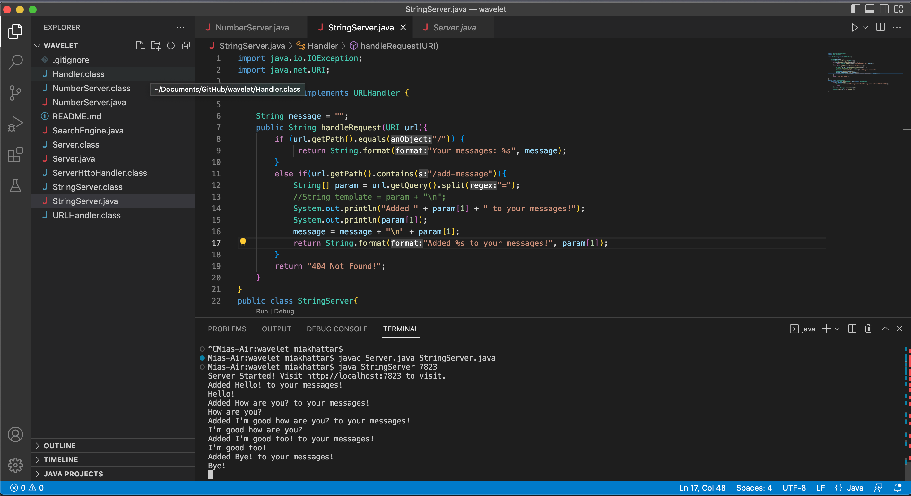
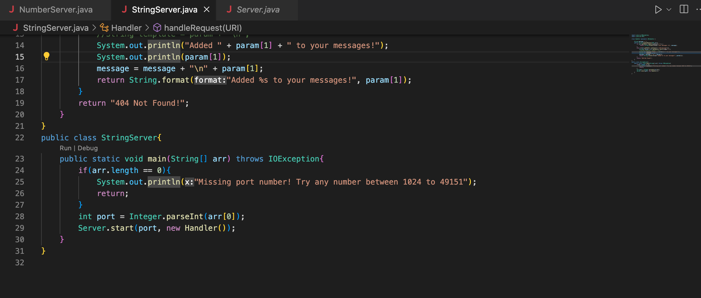
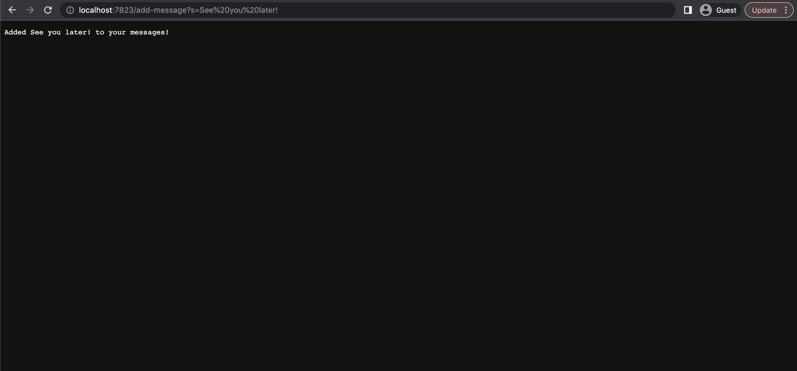
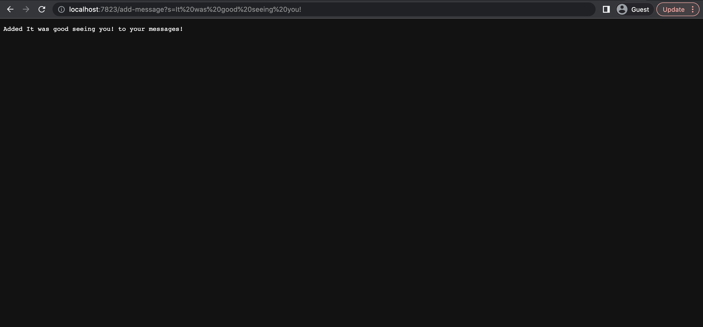
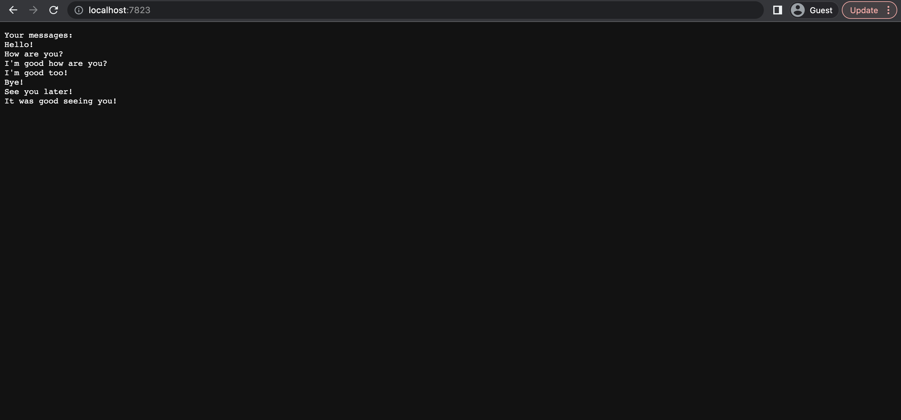

# Lab Report 2
## Part 1

For part 1, I created a website which adds messages to your collection of messages and displays all the messages you have added. Here are screenshots of my code and the terminal:

Below are two screenshots of my website when the path contains `add-message`:

In these two screenshots, there were multiple methods called. These methods were:
- `getPath()`
- `equals()`
- `format()`
- `contains()`
- `getQuery()`
- `split()`
- `println()`
- `main(String[] arr)`
- `length`
- `parseInt()`
- `start()`
- `handleRequest(URI url)`

The methods work as follows:
1. The user compiles and runs the code by calling `main()` with one argument which is a port number. This results in a link being created using the method `Integer.parseInt()` to create an integer out of the port number string argument followed by pluging it into `start()`. If there were no arguments, meaning `arr.length == 0`, then the program prints the error message `"Missing port number! Try any number between 1024 to 49151` and returns.
2. Then the method `handleRequest()` takes in the url as an argument. Afterwhich, the following occurs:
- if `url.getPath.equals("/")` then the website will display `Your messages:` with your messages displayed below it. It does this by calling the method `format()` which prints the strings in a specified format. Then the method returns.
- if `url.getPath.contains("/add-message")` then `String[] param = url.getQuery().split("=")` is called which splits the string into two and creates a new string array. Then, `System.out.println("Added " + param[1] + " to your messages!")` and `System.out.println(param[1])` is printed into the terminal and `String.format("Added %s to your messages!", param[1])` is returned which is displayed on the web page. Also, the feild variable `message` is updated by adding `"\n" + param[1]`. This variable represents what will be printed out when the url's path is only `/`.
- if `url.getPath.equals("/") == false || url.getPath.contains("/add-message") == false` then the `"404 Not Found!"` is returned and is displayed on the webpage.

The relevant arguments of these methods are as follows:
- `getPath()` (takes no arguments)
- `equals("/")` 
- `format("Your messages: %s", "Hello!" + "\n" + "How are you?" + "\n" + "I'm good how are you?" + "\n" + "I'm good too!" + "\n" + "Bye!" + "\n" + "See you later!")`
- `format("Added %s to your messages!", "See you later!")`
- `contains("/add-message")`
- `getQuery()` (takes no arguments)
- `split("=")` 
- `println("Added " + "See you later!" + " to your messages!")`
- `println("See you later!")`
- `main("7823")`
- `parseInt("7823")`
- `start(7823, new Handler())`
- `String message = "How are you?" + "\n" + "I'm good how are you?" + "\n" + "I'm good too!" + "\n" + "Bye!" + "\n" + "See you later!"` (this is a field)
- `handleRequest(http://localhost:7823/add-message?s=See%20you%20later!)`

This methods works specifically as follows:
1. The user compiles and runs the code by calling `main("7823")`. This results in a link being created using the method `Integer.parseInt("7823")` to create an integer out of the port number string argument followed by `start(7823, new Handler())`.
2. Then the method `handleRequest(http://localhost:7823/add-message?s=See%20you%20later!)` takes in the url as an argument. Afterwhich, the following occurs:
- `url.getPath.contains("/add-message")` is present so `String[] param = url.getQuery().split("=")` is called which splits the string into two and creates a new string array. Then, `System.out.println("Added " + "See you later!" + " to your messages!")` and `System.out.println("See you later!")` is printed into the terminal and `String.format("Added %s to your messages!", "See you later!")` is returned which is displayed on the web page. Also, the feild variable `message` is updated by adding `"\n" + "See you later!"`

A field whose value is changed is `message` as `"\n" + "See you later!"` is added to it. Below is another two screenshots of my website when the path contains `add-message`.

In these two screenshots, there were multiple methods called. These methods were:
- `getPath()`
- `equals()`
- `format()`
- `contains()`
- `getQuery()`
- `split()`
- `println()`
- `main(String[] arr)`
- `length`
- `parseInt()`
- `start()`
- `handleRequest(URI url)`

If you want to know the details of how the method in general is called refer to the previous part where I described how the methods are called and implemented.

The relevant arguments of these methods are as follows:
- `getPath()` (takes no arguments)
- `equals("/")` 
- `format("Your messages: %s", "Hello!" + "\n" + "How are you?" + "\n" + "I'm good how are you?" + "\n" + "I'm good too!" + "\n" + "Bye!" + "\n" + "See you later!" + "\n" + "It was good seeing you!")`
- `format("Added %s to your messages!", "It was good seeing you!")`
- `contains("/add-message")`
- `getQuery()` (takes no arguments)
- `split("=")` 
- `println("Added " + "It was good seeing you!" + " to your messages!")`
- `println("It was good seeing you!")`
- `main("7823")`
- `parseInt("7823")`
- `start(7823, new Handler())`
- `String message = "How are you?" + "\n" + "I'm good how are you?" + "\n" + "I'm good too!" + "\n" + "Bye!" + "\n" + "See you later! "\n" + "It was good seeing you!"` (this is a field)
- `handleRequest(http://localhost:7823/add-message?s=It%20was%20good%20seeing%20you!)`

This methods works specifically as follows:
1. The user compiles and runs the code by calling `main("7823")`. This results in a link being created using the method `Integer.parseInt("7823")` to create an integer out of the port number string argument followed by `start(7823, new Handler())`.
2. Then the method `handleRequest(http://localhost:7823/add-message?s=It%20was%20good%20seeing%20you!)` takes in the url as an argument. Afterwhich, the following occurs:
- `url.getPath.contains("/add-message")` is present so `String[] param = url.getQuery().split("=")` is called which splits the string into two and creates a new string array. Then, `System.out.println("Added " + "It was good seeing you!" + " to your messages!")` and `System.out.println("It was good seeing you!")` is printed into the terminal and `String.format("Added %s to your messages!", "It was good seeing you!")` is returned which is displayed on the web page. Also, the feild variable `message` is updated by adding `"\n" + "It was good seeing you!"`

A field whose value is changed is `message` as `"\n" + "It was good seeing you!"` is added to it.

## Part 2

For the method `reverseInPlace` there are two crutial bugs in the code:

1. The method does not contain a temporary value to save the value of the list's element before it is replaced by `arr[i] = arr[arr.length - i - 1];`
2. The method's for loop contains the condition `i < arr.length` when it should have been `i , arr.length/2` because if it goes through the entire list then it would replave values that have alrteady been replaced before.

Some JUnit test which I used to debug this code are:

- A JUnit test that displays this bug is `@Test public void testReverseInPlace() { int[] input4 = {1, 2, 3, 4}; ArrayExamples.reverseInPlace(input4); assertArrayEquals(new int[]{4, 3, 2, 1}, input4); }`. Its symptom is displayed in the image below:

- A JUnit test that works despite the bug is `@Test public void testReverseInPlace() { int[] input1 = { 3 }; ArrayExamples.reverseInPlace(input1); assertArrayEquals(new int[]{ 3 }, input1);`. It is seen working in the image below:

To get rid of the bugs, I did the following steps:
1. I added this line of code on line 8:`int value = arr[i];`. This line of code is used to create the temporary value of the original item in the list before it was updated because without this line the original value is replavced by the reversed one and it cannot replace the value that replaced it. 
2. I changed `i < arr.length` to `i , arr.length/2` because without it the for loop will loop through the entire list which causes it to replace the already replaced values which creates the wrong output.
3. I added this line of code to line 10 `arr[arr.length - i - 1] = value;`. This will replace the replacing value with the temporary value which was the item at the index before it was replaced making the two switch positions in the list

## Part 3

After completing the two labs, I learned how to make a website and update values on the website depending on the path which you type. I had no idea how to do this before and I think its a really cool skill to have.
