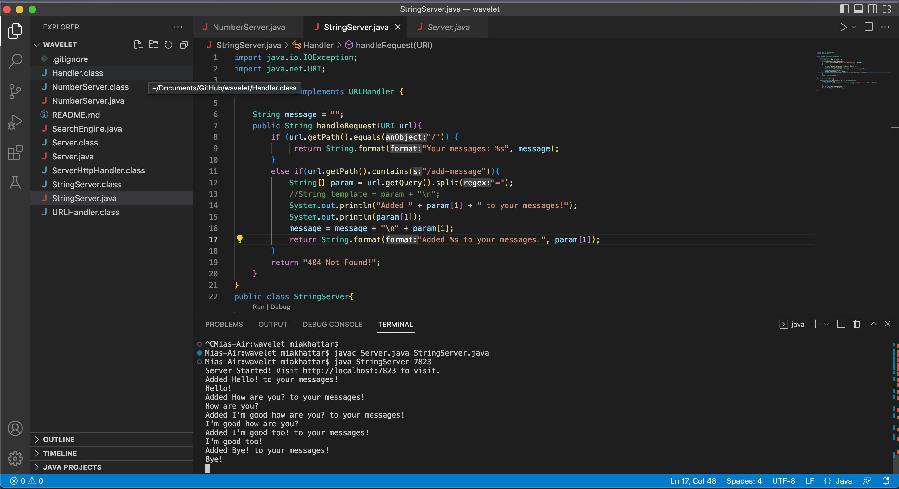
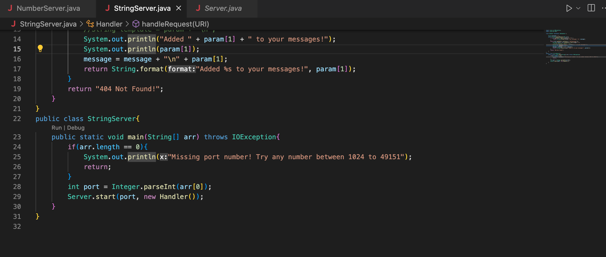
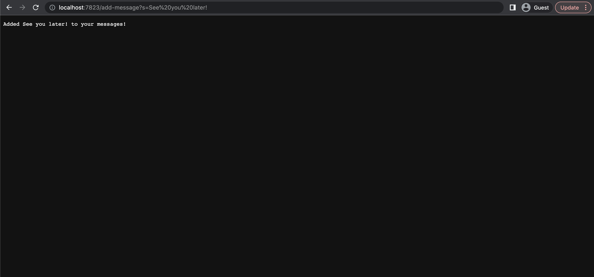
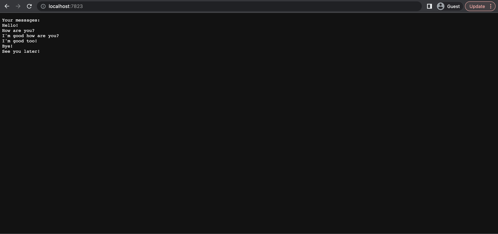
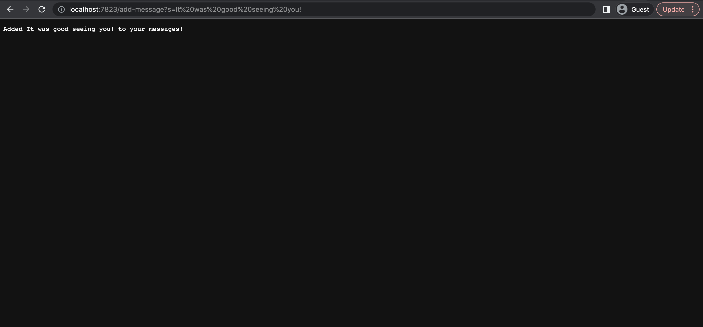
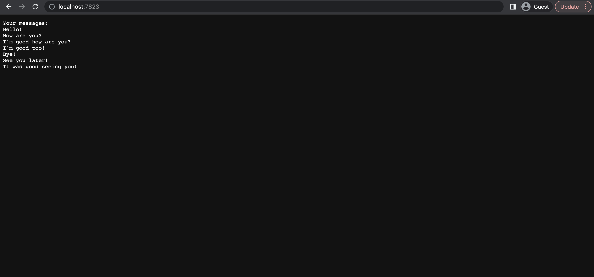
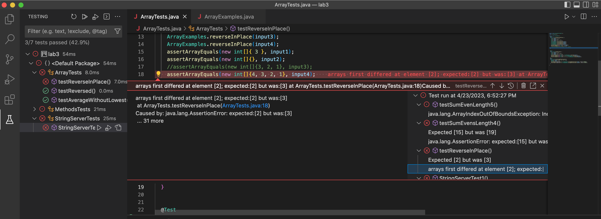
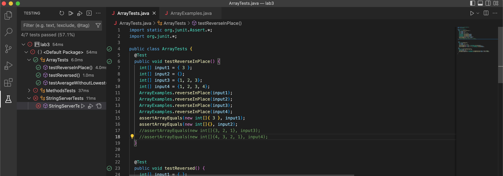

# Lab Report 2
## Part 1

For part 1, I created a website which adds messages to your collection of messages and displays all the messages you have added. Here are screenshots of my code and the terminal:

Below are two screenshots of my website when the path contains `add-message`:

In these two screenshots, there were multiple methods called. These methods were:
- `getPath()`
- `equals()`
- `format()`
- `contains()`
- `getQuery()`
- `split()`
- `println()`
- `main(String[] arr)`
- `length`
- `parseInt()`
- `start()`
- `handleRequest(URI url)`

The relevant arguments of these methods are as follows:
- `getPath()` (takes no arguments)
- `equals("/")` 
- `format("Your messages: %s", "Hello!" + "\n" + "How are you?" + "\n" + "I'm good how are you?" + "\n" + "I'm good too!" + "\n" + "Bye!" + "\n" + "See you later!")`
- `format("Added %s to your messages!", "See you later!")`
- `contains("/add-message")`
- `getQuery()` (takes no arguments)
- `split("=")` 
- `println("Added " + "See you later!" + " to your messages!")`
- `println("See you later!")`
- `main("7823")`
- `parseInt("7823")`
- `start(7823, new Handler())`
- `String message = "How are you?" + "\n" + "I'm good how are you?" + "\n" + "I'm good too!" + "\n" + "Bye!" + "\n" + "See you later!"` (this is a field)
- `handleRequest(http://localhost:7823/add-message?s=See%20you%20later!)`

A field whose value is changed is `message` as `"\n" + "See you later!"` is added to it. Below is another two screenshots of my website when the path contains `add-message`:

In these two screenshots, there were multiple methods called. These methods were:
- `getPath()`
- `equals()`
- `format()`
- `contains()`
- `getQuery()`
- `split()`
- `println()`
- `main(String[] arr)`
- `length`
- `parseInt()`
- `start()`
- `handleRequest(URI url)`

The relevant arguments of these methods are as follows:
- `getPath()` (takes no arguments)
- `equals("/")` 
- `format("Your messages: %s", "Hello!" + "\n" + "How are you?" + "\n" + "I'm good how are you?" + "\n" + "I'm good too!" + "\n" + "Bye!" + "\n" + "See you later!" + "\n" + "It was good seeing you!")`
- `format("Added %s to your messages!", "It was good seeing you!")`
- `contains("/add-message")`
- `getQuery()` (takes no arguments)
- `split("=")` 
- `println("Added " + "It was good seeing you!" + " to your messages!")`
- `println("It was good seeing you!")`
- `main("7823")`
- `parseInt("7823")`
- `start(7823, new Handler())`
- `String message = "How are you?" + "\n" + "I'm good how are you?" + "\n" + "I'm good too!" + "\n" + "Bye!" + "\n" + "See you later! "\n" + "It was good seeing you!"` (this is a field)
- `handleRequest(http://localhost:7823/add-message?s=It%20was%20good%20seeing%20you!)`

A field whose value is changed is `message` as `"\n" + "It was good seeing you!"` is added to it.

## Part 2

For the method `reverseInPlace` there are two crutial bugs in the code:

1. The method does not contain a temporary value to save the value of the list's element before it is replaced by `arr[i] = arr[arr.length - i - 1];`
2. The method's for loop contains the condition `i < arr.length` when it should have been `i , arr.length/2` because if it goes through the entire list then it would replave values that have alrteady been replaced before.

Some JUnit test which I used to debug this code are:

- A JUnit test that displays this bug is `@Test public void testReverseInPlace() { int[] input4 = {1, 2, 3, 4}; ArrayExamples.reverseInPlace(input4); assertArrayEquals(new int[]{4, 3, 2, 1}, input4); }`. Its symptom is displayed in the image below:

- A JUnit test that works despite the bug is `@Test public void testReverseInPlace() { int[] input1 = { 3 }; ArrayExamples.reverseInPlace(input1); assertArrayEquals(new int[]{ 3 }, input1);`. It is seen working in the image below:

To get rid of the bugs, I did the following steps:
1. I added this line of code on line 8:`int value = arr[i];`. This line of code is used to create the temporary value of the original item in the list before it was updated because without this line the original value is replavced by the reversed one and it cannot replace the value that replaced it. 
2. I changed `i < arr.length` to `i , arr.length/2` because without it the for loop will loop through the entire list which causes it to replace the already replaced values which creates the wrong output.
3. I added this line of code to line 10 `arr[arr.length - i - 1] = value;`. This will replace the replacing value with the temporary value which was the item at the index before it was replaced making the two switch positions in the list

## Part 3

After completing the two labs, I learned how to make a website and update values on the website depending on the path which you type. I had no idea how to do this before and I think its a really cool skill to have.
