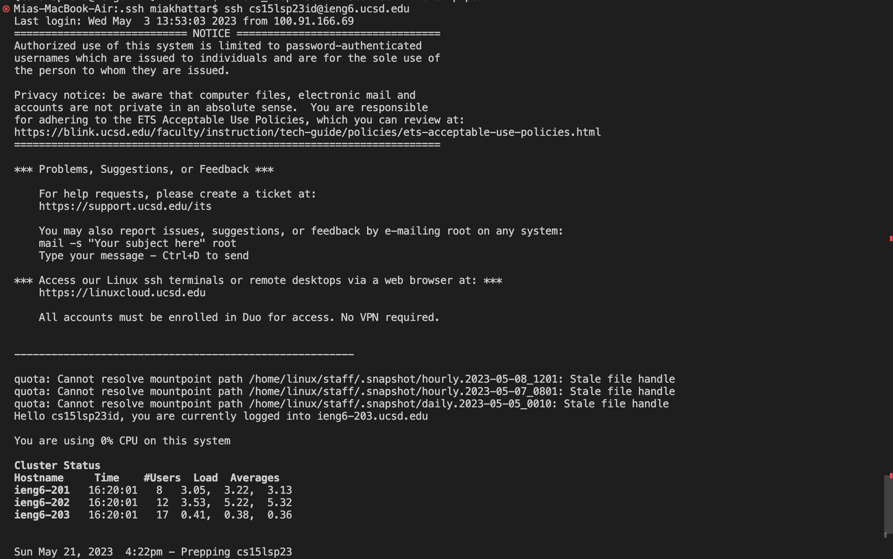
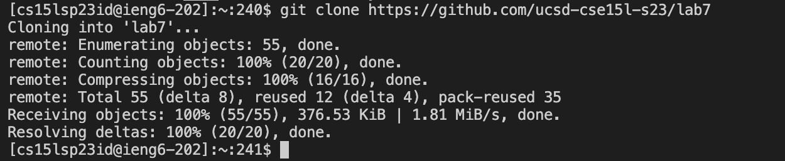
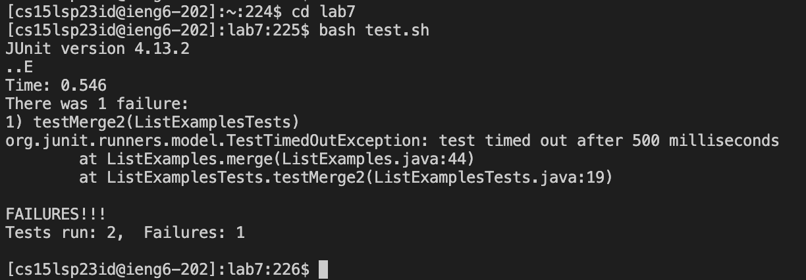
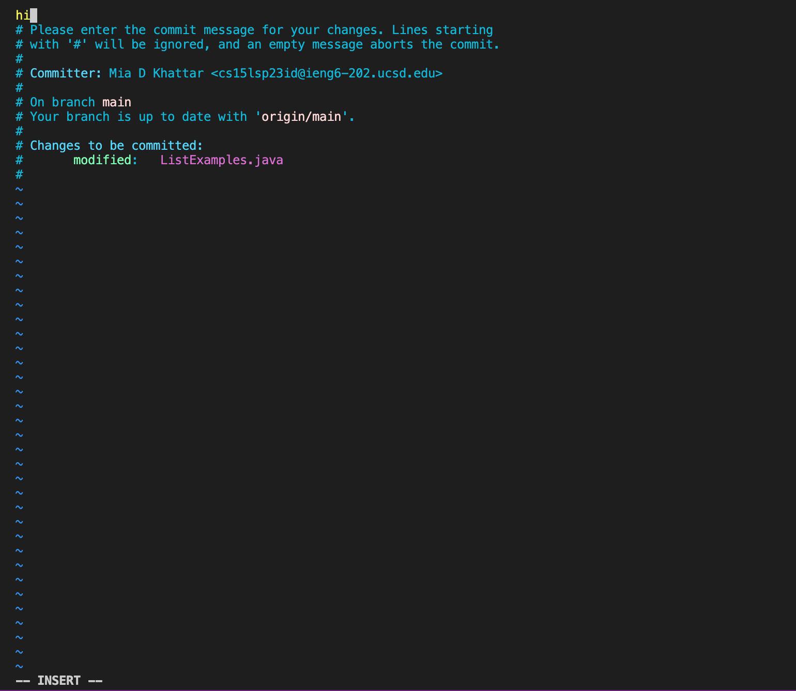
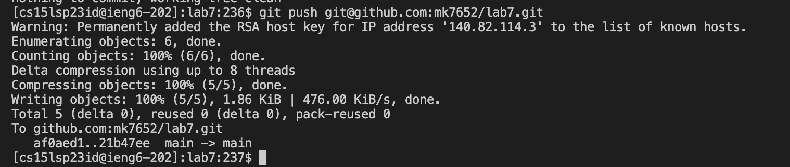

# Lab Report 4

## Logging into `ieng6`:

I ran the commands `<up><enter>` to go up 1 in the search history because the `ssh cs15lsp23id@ieng6.ucsd.edu` was 1 up in my history. I used this command to log into my `ieng6` account. It took me around 5 seconds to complete this step.

## Cloning the fork:

I ran the commands `<git clone><copy><paste><enter>` to copy and paste the link from my fork which was `https://github.com/mk7652/lab7` which made the command `git clone git@github.com:mk7652/lab7.git` so that I could clone my fork of the repository.  The timer is at around 10 seconds. 

## Running the Tester:

I used `<cd> <><l><a><b><7><enter>` to change the current directory to `lab7`. Then I ran `<b><a><s><h>< ><t><tab><enter>` to run the test. I used `<tab>` to auto fill the rest of the file name. The test said two tests ran one faliure. The timer is now at 54 seconds.

## Editing the Code in VIM:

I used the command `<v><i><m>< ><shift + l><tab><.><tab><enter><x><i><2><esc><:wq>` which allowed me to use vim to edit ListExamples.java by typing in `vim ListExamples.java` (again I used tab to auto fill). Then, when I entered vim, my cursor was already on the `1` of `index1` so I typed `x` to delete it. Then, I went into insert mode by typing `i` and then I typed `2` and to change `index` to `index2` then `esc` to leave insert mode. then I typed `:wq` to save my changes and return to commit mode. The timer is now at 1:35.

## Retesting the Code:

I then ran the tests again by using`<up><up><enter>` to go two up in my history where `bash test.sh` was. The two tests now pass. The timer is now at 1:45. 

## Commiting and Pushing:

Then, I ran the command `git .add <enter>`. This added the changes from the current directory (referenced by `.`) which I made so that they can be commited. Then, I ran `git commit <enter>` which entered me into vim mode to commit my changes. In this mode, I ran the commands `<i><h><i><esc><:wq>` which let me add a commit message then save the file. My commit message was `hi`. Then, I ran `git push git@github.com:mk7652/lab7.git <enter>` which pushes my changes into my `lab7` repository. It is crutial to provide your own `ssh` link when you push or the push command will not work because it needs a destination to push to. you can find your own ssh url for a lab 7 by clicking on lab7 in your repositories then click on code then click on the tab that says ssh and copy that link then paste it rigth after `git push`. Then if you look in your lab7 repository you will notice that ListExamples.java is updated with your changes.

