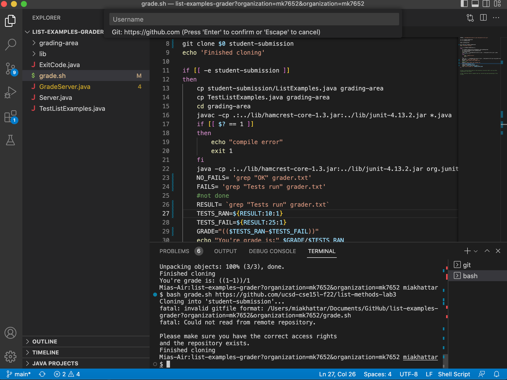
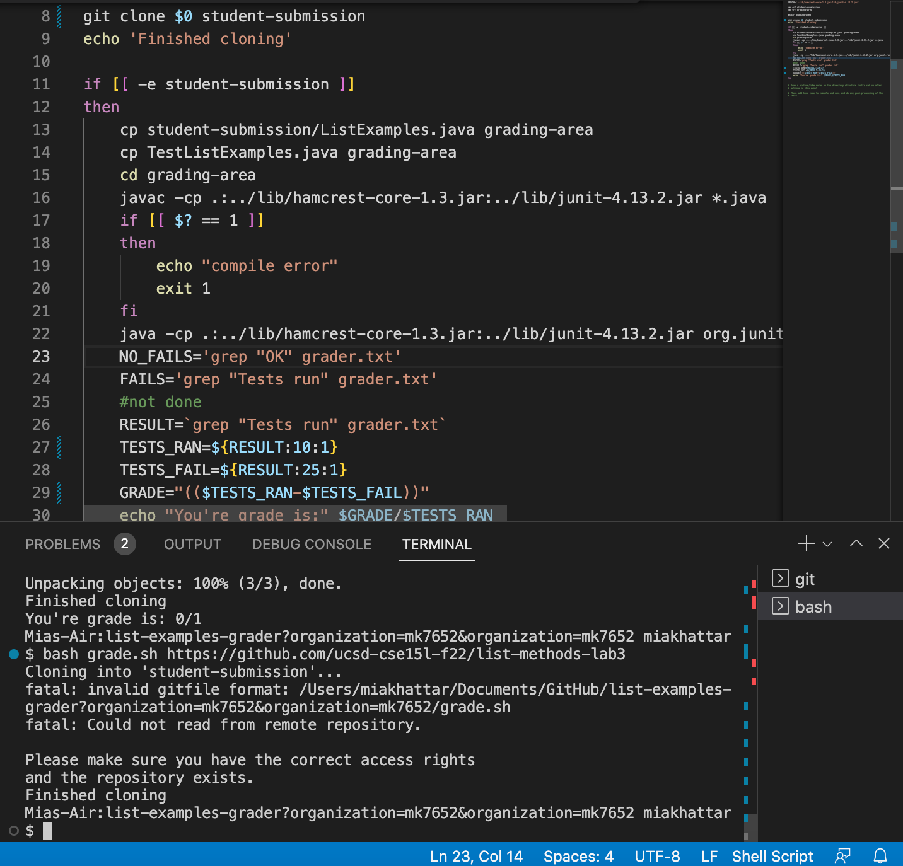
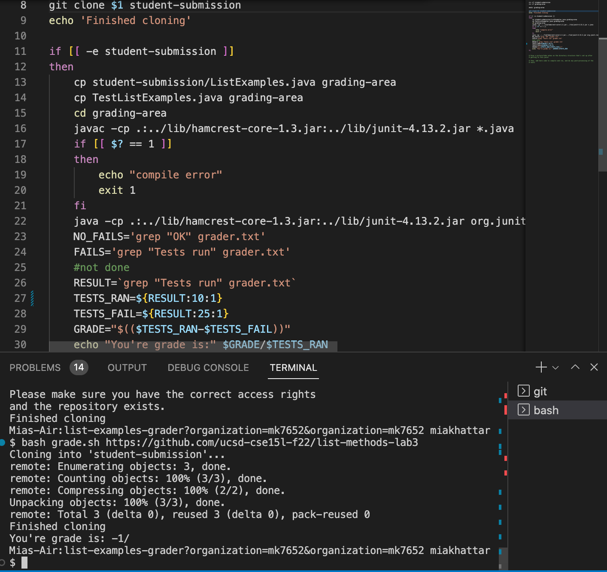
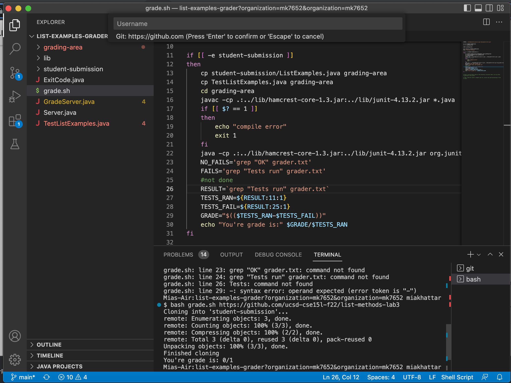
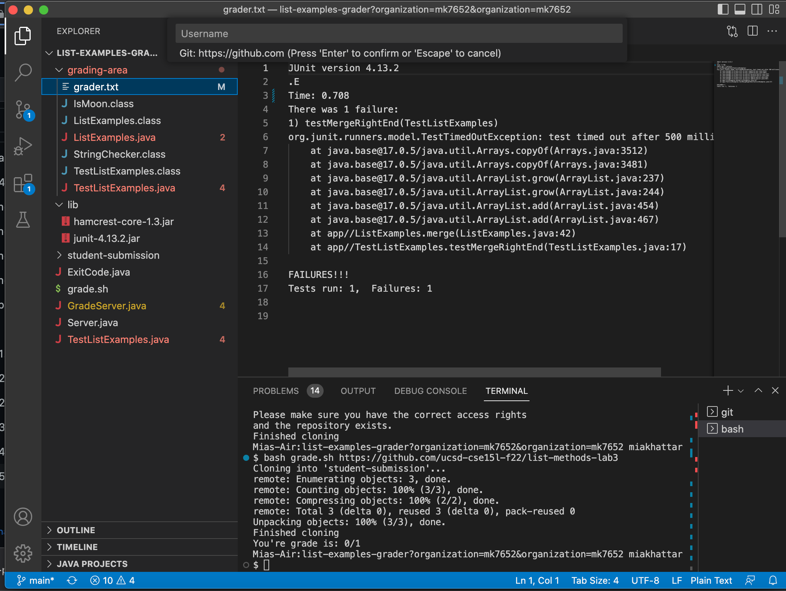

# Lab Report 5

## Part 1

## **Student's Initial EdStem Post:**

Hello, I am curently experiencing errors in my code for `grader.sh`. For background, I am on a Mac and I am running commands in a terminal on VS Code. I am currently experiencing a bug when I try running the command `$ bash grade.sh https://github.com/ucsd-cse15l-f22/list-methods-lab3` as it printed out `finished cloning` but it says that it couldn't read from the remote repository and I need the correct access rights as seen below in the screenshot of my code. This command is supposed to take in a students submission and grade it and give certian feedback based on their errors. It does this by cloning the given repository into a folder called `student-submission` and this folder's contents gets replaced after every time this code is run. when I ran this command the current working directory was `list-examples-grader?organization=mk7652&organization=mk7652` but at line 15 the current directory gets changed to `grading-area` as seen in the screenshot. I didn't run any commands before this as I just opened up my code after not working on it for a while. 

I am not exactly sure what may be causing this error but if I had to guess the bug is probably some sort of syntax error as formatting `.sh` files can be really confusing to me because of all the little details. Thank you for your time!

## **TA's Response:**

Hello, thank you for your question! You are partially correct, it looks like a syntax error could cause the symptom that you are experiencing but that is not all. First, try deleting the spaces between the `=` and the string corellated with the variable on lines 23, 24, and 26 and look for any other syntax errors that could be causing bugs. Also, It looks like you might be taking in the wrong command line argument in part of your code and try to think about what your variable `RESULT` is comprised of. Try to figure it out and let me know if you need more help!

## **Student's Response:**

I just tried deleting the spaces and it fixed part of my error! I also looked through my code and I found out that I was taking in the argument `$0` instead of `$1` on line 8. Also, I noticed that on line 29 I was missing a `$`. Then, after I fixed that I relized that on line 27 it should have said `TESTS_RAN=${RESULT:11:1}` instead of `TESTS_RAN=${RESULT:10:1}` because it was taking the wrong part of the file `grader.txt` before I fixed it. Turns out the bugs in my code were that I had extra spaces between the `=` and the string, I was missing a `$`, I was taking in the wrong command line argument, and I was taking the wrong part from a file I was referencing. Here's what my code looks like now and my process of fixing it. Thank you so much for your help!

1. After fixing the spaces:

2. After fixing the `$0` and adding `$` on line 29:

3. Correct implementation after fixing `TESTS_RAN=${RESULT:10:1}`:

## **All the Information about the Files:**

Here are the important files before and after the bug was fixed:

1. `grader.sh`:
- Before:

- After:

2. `grader.txt`:
- Before and after (they stayed the same)

I ran the command `$ bash grade.sh https://github.com/ucsd-cse15l-f22/list-methods-lab3` to trigger the bug. My current working directory at the time was `list-examples-grader?organization=mk7652&organization=mk7652` but line 15 changes it to `grading-area`. To fix the bug I first deleted the spaces on lines 23, 24, and 26. Then, I changed `$0` to `$1` on line 8 and added a `$` on line 29. Lastly, I changed `TESTS_RAN=${RESULT:11:1}` to `TESTS_RAN=${RESULT:10:1}` on line 27. 

## Part 2

## **Reflection:**

Something interesting I learned to do in lab was how to set up `.sh` files and how to use them. Before this course, I had no idea that they even existed and even though I am still a little confused about them now and their syntax, I feel as I program more they will become a very useful tool and I will gain confidence in my ability to work with them. I also though that VIM was a super cool tool as well which I also had no idea existed. This class was very interesting and I'm very thankful for all the new knowledge that I am taking from it!

