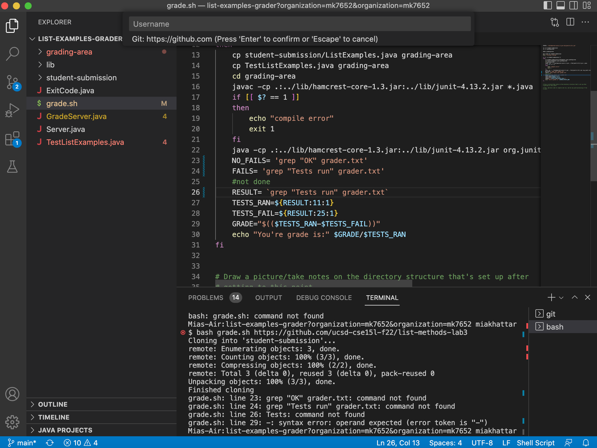

# Lab Report 5

## Part 1

## Student's Initial EdStem Post:

Hello, I am curently experiencing errors in my code for `grader.sh`. For background, I am on a Mac and I am running commands in a terminal on VS Code. I am currently experiencing a bug when I try running the command `$ bash grade.sh https://github.com/ucsd-cse15l-f22/list-methods-lab3` as the command clones the repository correctly but for some reason it is giving me the errors as seen below in the screenshot of my code. This command is supposed to take in a students submission and grade it then give certian feedback based on their errors. It does this by cloning the given repository into a file called `student-submission` and this file's contents gets replaced after every time this code is run. when I ran this command the current working directory was `list-examples-grader?organization=mk7652&organization=mk7652` as seen in the screenshot. I didn't run any commands before this as I just opened up my code after not working on it for a while. 

I am not exactly sure what may be causing this error but if I had to guess the bug is probably some sort of syntax error as formatting `.sh` files can be really confusing to me because of all the little details. Thank you for your time!

## TA's Response:

Hello, thank you for your question! You are correct, it looks like a syntax error is causing the symptom that you are experiencing. Try deleting the spaces between the `=` and the string corellated with the variable on lines 24, 26, and 27 and let me know if that works!

## Student's Response:

I just tried it and it fixed my error, thank you so much for your help! Turns out the bug in my code was that I had extra spaces between the `=` and the string just like you said. Syntax can be really hard sometimes. Here's what my code looks like now.

## Part 2

## Reflection:

Something interesting I learned to do in lab was how to set up `.sh` files and how to use them. Before this course, I had no idea that they even existed and even though I am still a little confused about them now and their syntax, I feel as I program more they will become a very useful tool and I will gain confidence in my ability to work with them. I also though that VIM was a super cool tool as well which I also had no idea existed. This class was very interesting and I'm very thankful for all the new knowledge that I am taking from it!

